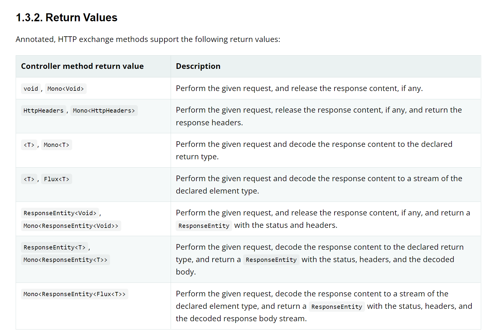
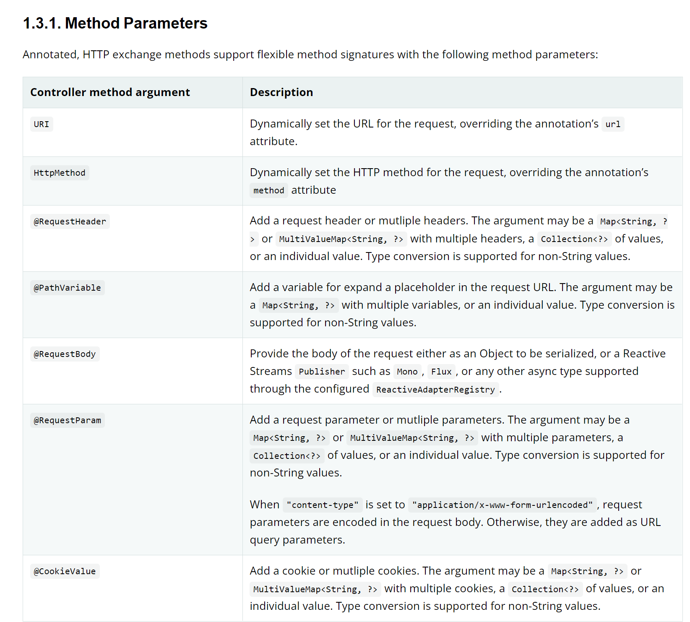

# Spring Framework 6

Here we use a mock API to demonstrate the functionality

### Technologies:
- Spring Framework 6
- JDK 17: Records

## Return Values

Source:
https://docs.spring.io/spring-framework/docs/6.0.0-SNAPSHOT/reference/html/integration.html#rest-http-interface-return-values

## Methods Parameters

Source:
https://docs.spring.io/spring-framework/docs/6.0.0-SNAPSHOT/reference/html/integration.html#rest-http-interface-method-parameters
